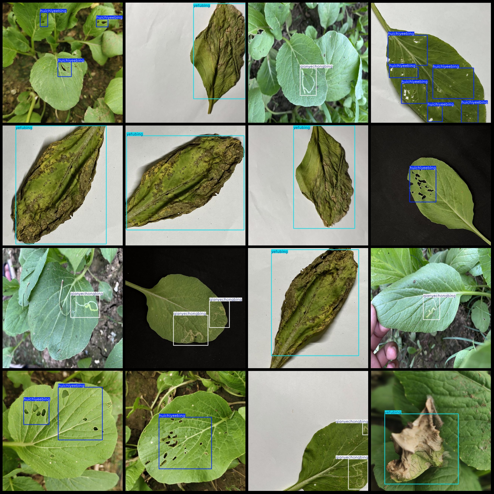
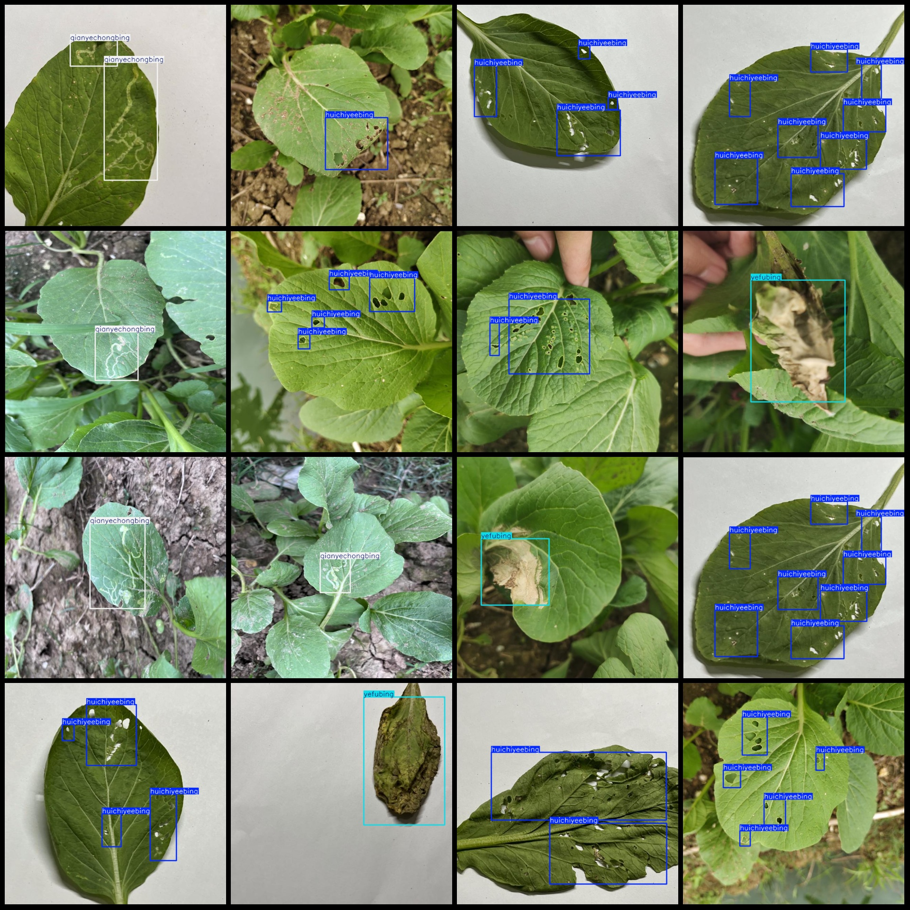

# Smart Agriculture Cabbage and Pickle Leaf Disease Detection Dataset VOC+YOLO Format with 2305 Images in 3 Categories

Dataset format: Pascal VOC format + YOLO format (txt file without split path, just containing jpg images and corresponding VOC format xml files and YOLO format txt files)
Number of images (jpg file count): 2305
Number of annotations (xml file count): 2305
Number of annotations (txt file count): 2305
Number of categories: 3
Annotation categories (notice the order of labels in YOLO format does not correspond to this, but refer to the labels folder 'classes.txt' for consistency): ["huichiyeebing", "qianyechongbing", 
"yefubing"]
Corresponding Chinese category names: ["Gray-winged night moth disease", "Leafhopper disease", "Leaf rot disease"]
Number of bounding boxes per category:
huichiyeebing = 2207
qianyechongbing = 1242
yefubing = 741
Total bounding boxes = 4190
Number of images per category:
huichiyeebing = 758
qianyechongbing = 836
yefubing = 724
Image resolution: 640x640
Annotation tool used: labelImg
Annotation rules: draw bounding boxes for categories
Important notice: The dataset does not have been divided into training, validation, or test sets, so you will need to do that yourself.
Special declaration: This dataset does not guarantee any accuracy of the trained models or weights files.
Image preview:

## Images

Here is a pay link on Stripe ( https://buy.stripe.com/3cs8yP7sY87d0vu9AB ). Please contact me lonlonago@foxmail.com after funding $89, and I will send you a complete data files , thank you!

